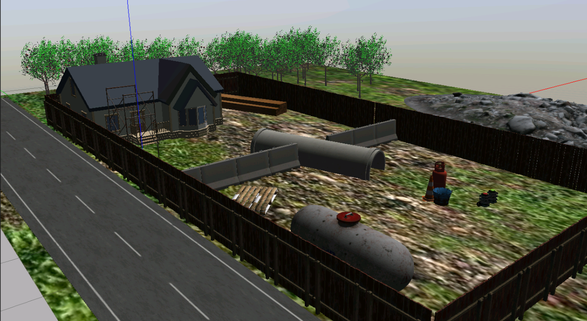
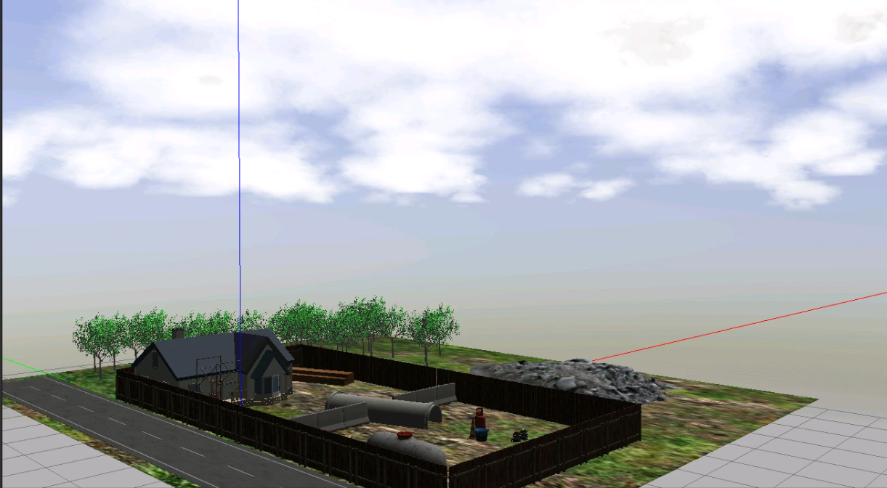

# Construction-Environment-Turtlebot

## Introduction
Construction site environment for 2 turtlebots 3, including textured ground plane, clouds and several 3D models exported from blender. 
For ROS2 - Humble 



## Requirements
```sh
sudo apt-get install ros-humble-gazebo-ros-pkgs
```

## Instalation
To install this repository on your home folder:
```sh
cd ~
git clone git@github.com:mefisto2017/Construction-Environment-Turtlebot.git
cd Construction-Environment-Turtlebot
colcon build
```
Before running the repository the models path needs to be setup:
```sh
echo 'export GAZEBO_MODEL_PATH=~/Construction-Environment-Turtlebot/src/turtlebot3_simulations/turtlebot3_gazebo/models:${GAZEBO_MODEL_PATH}' >> ~/.bashrc
source ~/.bashrc
```

## Run Simulation


### Gazebo
```sh
source ./install/setup.bash
ros2 launch turtlebot3_gazebo turtlebot3_tc_world_test.launch.py
```
